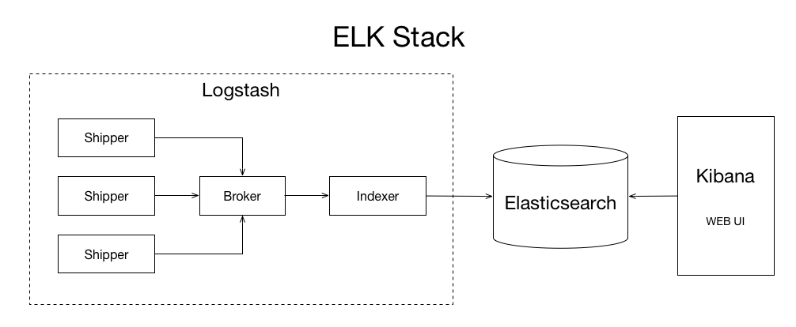

集中式日志系统
===

ELK是Elasticsearch, Logstash 和 Kibana三个软件的首字母简写，这三个软件组合在一起构建集中式日志系统，也称ELK协议栈。

## Elasticsearch
Elasticsearch是一个实时的分布式搜索和分析引擎，用于搜索日志。是整个系统的核心。

## Logstash
Logstash是一个数据收集引擎，负责把各个微服务的日志手机到一起并存储。由三部分组成：

  * Shipper 发送日志数据
  * Broker 收集数据
  * Indexer 写入数据
  
## Kibana
Kibana为Elasticsearch提供UI，负责用户界面。

## ELK体系结构图
下图说明了ELK体系的工作原理，Shipper负责从各个微服务处采集日志数据，并发送到Broker，Indexer把Broker中的数据再写入到Elasticsearch，Elasticsearch对数据存储并创建索引。Kibana负责对数据分析并展现给用户。

